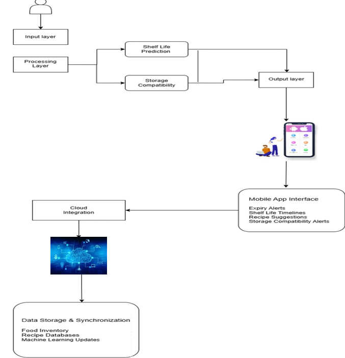

# **Project Name - INTELLIGENT FOOD SHELF–LIFE MONITORING SYSTEM**

# **Group Number - R25-073**

# **Group Members -**

| Name with initials | Registration Number | Contact Phone Number | Email | Badge |
|--------------------|---------------------|-----------------------|-------|-------|
| Perera P.A.E.U.K | IT21829710 |  0770417101  | [it21829710@my.sliit.lk](mailto:it21829710@my.sliit.lk) |  |
| Kularathna E.M.S.D |  IT21828720  | 0775614161 | [it21828720@my.sliit.lk](mailto:it21828720@my.sliit.lk) |  |
| Fernando M.G.S.S.A | IT19970882 |  0713441221 | [it19970882@my.sliit.lk](mailto:it19970882@my.sliit.lk) |  |
| Perera B.C.V|IT20196110  | 0741399030 | [it20196110@my.sliit.lk](mailto:it20196110@my.sliit.lk) |  |

# **Brief Description of The Research Problem -**

Food waste and spoilage remain persistent global challenges, especially in household and small-scale food management. A major contributing factor is the inability to monitor food freshness in real time, leading to delayed consumption or unnecessary disposal. Additionally, improper storage conditions—such as unsuitable temperature, humidity, or placement—accelerate spoilage, especially for perishable goods.
Compounding the issue is the lack of personalized food tracking systems that can cater to individual consumption habits and household needs. Existing expiration date labeling methods are static and often conservative, failing to reflect the actual freshness or remaining shelf life. Without smart tools to predict or notify users about spoilage risks, large amounts of edible food are wasted daily.
This research aims to address these issues by exploring AI-based freshness prediction, label-based expiry tracking, and user-friendly alerts to support smarter and more sustainable food usage.

# **Brief Description of The Research Solution -**

To reduce household food waste and spoilage, our mobile-based system combines AI, image processing, OCR, and IoT sensors to monitor food freshness in real time. Users can capture images of fruits, vegetables, and homemade foods, which are classified into freshness stages using a trained model. Based on these predictions, the system estimates the remaining shelf life and notifies users when food is near expiration. Packaged food labels are scanned using OCR to extract expiration dates, which are stored and tracked for timely alerts. Gas and environmental sensors detect spoilage in homemade foods and monitor storage conditions like humidity and temperature to ensure proper food placement.
In addition, the system offers recipe suggestions based on user preferences, allergies, and the most perishable items. A recommendation engine uses ingredient matching to suggest meals that help consume foods nearing spoilage. This feature promotes healthier eating habits while reducing unnecessary waste. All components—freshness detection, label tracking, environmental monitoring, and personalized recipes—are integrated into a user-friendly mobile app with a cloud-connected backend, making it a complete smart food management solution.

# **System Diagram -**

 

